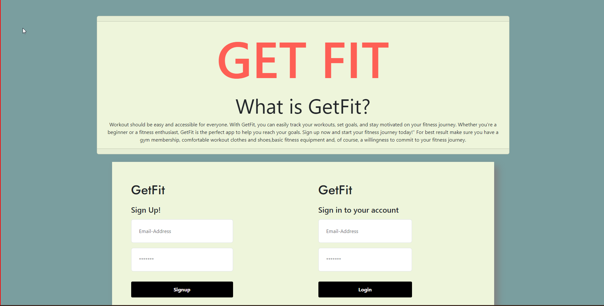

 <h1>GETFIT<h1>

A workout app for beginners and experts across the board. Quickly Signup and Login through our landing page. Once logged in simply choose your workout and start to GETFIT.

 
 <h3>Table of Contents:<h3>

Introduction,

Features,

Getting Started,

Usage,

Dependencies,

Contributing,

License,

Upcoming Features,

FAQ,

Credits/Links

 
 <h3>Introduction:<h3>

Workout should be easy and accessible for everyone. With GetFit, you can easily track your workouts, set goals, and stay motivated on your fitness journey. Whether you're a beginner or a fitness enthusiast, GetFit is the perfect app to help you reach your goals. Sign up now and start your fitness journey today!" For best result make sure you have a gym membership, comfortable workout clothes and shoes,basic fitness equipment and, of course, a willingness to commit to your fitness journey.

 
 <h3>Features:<h3>

Workout any muscle group you'd like.
Recieve a motivational quote upon login.

 
 <h3>Getting Started:<h3>

To get started Sign up though our login page, create an account, select a workout, and begin

 
 <h3>Usage:<h3>

WHEN: the user opens the site 
THEN: they are provided with the description of what the app entails & a login and signup area. 

WHEN: the user signs-up or has logged in
THEN: they will be taken to the main page where they can see previous and current exercise info

WHEN: user sees(or clicks) on the 'previous workout' section
THEN: their last workout session will be retrieved through our database

WHEN: user clicks on 'today's workout'
THEN: they will be redirected to separate page that displays different muscle groups 

WHEN: user chooses which muscle group they would like to workout that day
THEN: they will be prompted with four exercises for that muscle group, pulled from our seeds file.

WHEN: done with workout, the user can click on the bottom right corner button
THEN: they will be redirected  back to main page

WHEN: the user is redirected back they will  click the 'cool down' section that will redirect you to separate page
THEN: they will be prompted with motivational quote and three quick exercises to end their day

 
 <h3>Contributing:<h3>

If you'd like to contribute your thoughts or Ideas/Bug problems/Issues with the website we would gladly accept your input at GETFIT@mindyabusiness.com

 
 <h3>Upcoming Features:<h3>

-Reminder of previous session workout, so people know what they workedout last.

-Caloric Counter, tracks calories burned/calorie input for daily workouts/meal

-Workout timer to track length of workout.

-Meal Prep/Diet Tips.

-MORE WORKOUTS!

 
 <h3>FAQ:<h3>

Q:Where should i use the app?

A:We recommend using the app at the gym, thats where youll be more productive!

Q:Did we come up with the motivational quotes?

A:Maybe? Either way they sure are motivational.

Q:Do i need to sign up to use the app?

A:Yes! you will have to create a profrile to use the app.

Q:Will you be adding more to the website?

A:Yes! you can send us your ideas/bug issues at GETFIT@mindyabusiness.com

Q:What if i dont like the workout provided?

A:Choose a different workout! Theres plenty to choose from.

 
 <h3>Credits:<h3> Here at GETFIT we'd like to express our greatest thanks to the authors of GETFIT listed Below:

Author: Abigail Garcia,

Author: Michael Sigala,

Author Arevik "Sunny" Abrahamyan,

Author: Oscar Leal,

Author: Cole Chaffin

Thank you and GOOD LUCK in your future endeavors!

-GETFIT Managment

Link to deployed website:

Link to Github repository: https://github.com/Sunny9810/Workout-App