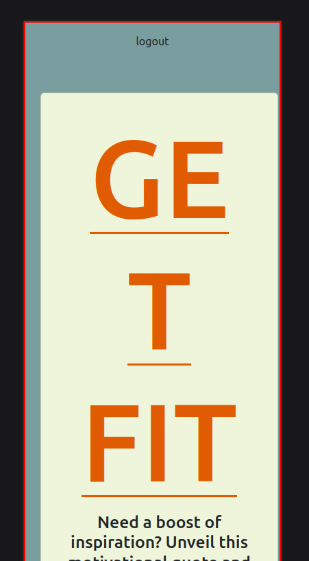
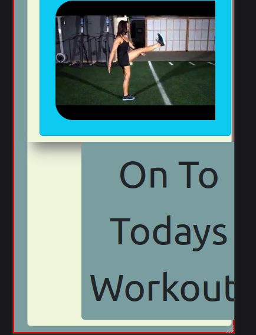
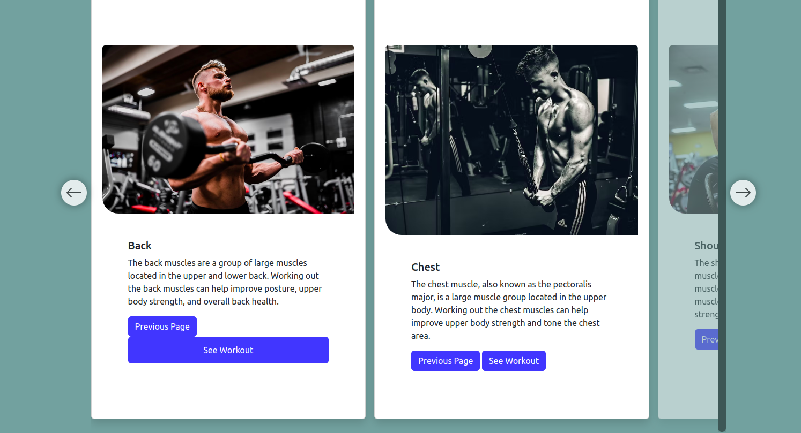
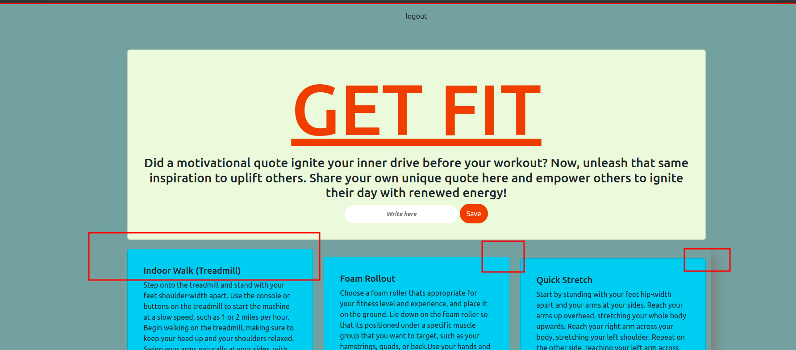

# Comments on Styling

- Responsiveness could use some work, when it's in an iPhone screen size, it's difficult to see

- This application is greatly made for mobile with your style, so mobile/responsive development first is recommended for it. 

- Some work on the styling of buttons (logout, carousel buttons) would help it look a bit cleaner and easier to follow the flow

- The workout modals are just excellent and the data there is great. Pictures might help, but the instructions are great. 

- Styling of the modals a bit would spruce it up, like a background/border or something

- The cooldown page is great, especially where you can add the quote in

- I would take some time for consistent styling here with the sections to make the page looks crisp

### Functionality of this website is just pristine, everything works as it should and the database is clean